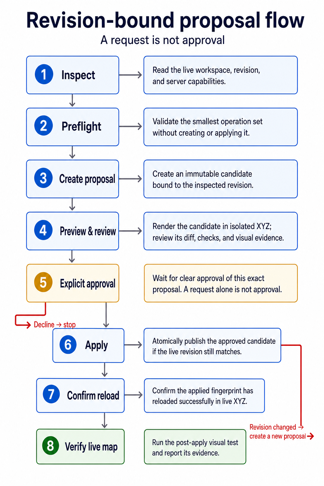

# Agent workflow

This workflow is mandatory when an AI agent uses `config-cli` to change a
remote MAPP workspace. The goal is to keep target selection, intent
resolution, approval, application, and verification as separate auditable
steps.



The diagram summarizes the mandatory path below. Its preview step means
proposal-bound rendering of the pending candidate in isolated XYZ before
approval; its final verification step tests the live map after application.

## 1. Identify the target

Run:

```sh
config-cli --profile PROFILE doctor
config-cli --profile PROFILE describe
config-cli --profile PROFILE auth status
config-cli --profile PROFILE capabilities list
```

`doctor` checks local profile and credential-file safety, identity, contract
compatibility, authentication, scopes, workspace access, and advertised SQL
and visual capabilities without revealing the credential. Use it after
interactive setup and when troubleshooting; `describe` remains the source for
the exact target and revision used in the change workflow.

Report the selected profile, normalized endpoint, live instance ID, workspace
key, current revision, authenticated actor/scopes, and compatibility result.
Use the advertised action schemas as the current server truth. Do not infer an
unsupported action from client documentation, and do not use capability
discovery to bypass the named proposal commands.
Stop on an instance-ID mismatch, unsupported contract, authentication failure,
or unexpected endpoint.

Never infer that a familiar profile name still points to the expected server.

## 2. Inspect before proposing

Use the smallest set of read operations needed to understand the request:

```sh
config-cli workspace get
config-cli layers list
config-cli layers get "LAYER KEY"
config-cli schema --pointer "JSON POINTER"
config-cli rules
config-cli catalog list
config-cli icons list
config-cli sql capabilities
```

XYZ layer folders are not nested workspace objects. Layers with the same
non-empty `group` string render in one drawer. Use
`config-cli layers list --group "GROUP"` to inspect effective membership and a
focused `/locale/layers/LAYER/group` (or named-locale override) proposal
operation to add or move a layer. Unset the property to remove membership.

Group colour is a deployed CSS concern exposed by XYZ through each member's
`groupClassList`. The first layer that creates the drawer supplies its class
list, so inspect the exact group and set the same verified deployed class list
on every member. A hex value is not a class, and `groupColor`/`groupColour` are
not framework properties. If the requested class is not present in the
deployed map stylesheet, disclose that deployment gap instead of proposing a
workspace value that cannot render. Preview the affected group drawer before
approval.

Inspect `layers style-elements "LAYER KEY"` before changing the interactive
Styling drawer. `style.elements` controls order and inclusion only; each
built-in element still needs its corresponding `style.<key>` configuration.
Preserve audited custom style values. Reject unadvertised keys. Use `style.hidden`, not deletion of rendering
styles, when the request is only to suppress the drawer.

Inspect `layers filters "LAYER KEY"` before changing interactive filters. XYZ
derives them from `infoj` entries plus the layer `filter` object; preserve the
entry index, field, type, advanced options, and unknown extensions. Distinguish
interactive filters from `filter.default`, a fixed server-side restriction
that may carry trusted template SQL requiring explicit security review.
Do not enable interactive filters on calculated `infoj[].fieldfx` aliases:
pinned XYZ builds filter SQL and numeric min/max requests against the literal
`field` name, not the `fieldfx` expression. Use a real table column or first
expose the calculation as a derived-layer output column.

Resolve natural-language intent to the effective workspace property. Layer
keys, labels, database relations, locale names, style states, and theme-driven
overrides are independent concepts. Ask the user when the request could
reasonably select more than one target or interpretation.

The top-level `locale` is the default even when named `locales` exist. XYZ
composes the default into named alternatives with framework-specific merge
rules, including conditional array concatenation/replacement. Inspect the
effective layer, but target the raw property that owns the requested override;
do not manufacture a generic deep merge or copy an entire inherited layer.
If raw `workspace.locale` is absent, XYZ still selects a synthetic empty
default for no option or `--locale locale`; never infer that a sole named
locale is the default.

Reject unknown XYZ, plugin, template, and advanced properties; do not silently
delete them. Only fields explicitly advertised under
the connected server schema's typed `properties` maps have been audited
against that server's pinned XYZ version. An unlisted locale key is invalid.

Before changing templates or plugin configuration, inspect:

```sh
config-cli schema --pointer '/$defs/templateDefinition'
config-cli schema --pointer '/$defs/locale/properties'
config-cli schema --pointer '/$defs/layer/properties/gazetteer'
config-cli plugins list
config-cli plugins validate
config-cli plugins usage
```

Pinned XYZ v4.23.4 exposes database/coordinate gazetteer behavior through
`layer.gazetteer`; the similarly shaped locale-level object is not consumed.
Its live template loader accepts audited provider-qualified `src` descriptors,
but descriptor validation neither fetches the source nor executes template SQL
or module code. Include post-apply reload and functional/visual evidence for
such a change.

For plugin work, use `plugins show KEY` and `plugins usage KEY`; distinguish module sources in
locale/layer `plugins[]`, ordering in `syncPlugins[]`, and the same-named
configuration property. Dynamic imports use all-settled behavior, so a loading
map does not prove every module loaded. Verify bundled registration or review
the external module's `mapp.plugins` side effect, then collect post-apply
browser evidence for the affected behavior. A changed catalogue fingerprint
makes an earlier proposal and its preview stale.

Inspect `infoj` before adding a feature-information field. A requested value
may already be displayed, may exist as an unused catalog column, or may require
a new calculated expression. Ask which interpretation is intended rather than
adding a duplicate. For line layers, “area” is ambiguous: line geometry itself
has no polygon area, while length multiplied by width is only an approximate
rectangular footprint.

Treat “legend in the info panel with counts” as potentially spanning three
independent controls. Inspect `layers style-elements` for the theme legend,
`layers filters` for category statistics and viewport behavior, and `infoj`
for clicked-feature content. Do not claim that enabling one surface changes
the others.

For a categorized theme, a compatible `filter.type="in"` on the same field
plus `layer.filter.viewport=true` provides viewport-scoped generated category
statistics in the Filtering panel. If the user separately requests a static
legend inside clicked-feature information, use a bounded `type="html"` entry
with a constant `fieldfx` text expression copied from the inspected theme.
Explain that it is duplicated static markup, not a live binding to
`style.theme`, and that viewport counts remain in the Filtering panel.

If a categorized point layer needs symbols composed from more than one
attribute, use `style.theme.fields` plus a category-level `field` on each
category. Do not leave `style.theme.field` in place; the workspace schema
requires either the single-field form or the multi-field form. This produces
point icon arrays, so do not use it for line or polygon symbology.

Constant HTML still passes through the SQL expression validator and render
probe. Avoid semicolons in inline CSS because the safety scanner treats them as
statement separators even inside a string. If the new info alias does not yet
exist, standalone `sql test` cannot select it; the complete candidate must pass
`proposals check`. Adding the entry can require exact parent-array replacement,
so preserve and review every existing `infoj` sibling and its order.

## 3. Build the smallest operation set

Use only the JSON Pointer operations required for the request. Do not replace a
parent object when changing one nested property. Do not normalize, reorder, or
clean up unrelated configuration.

JSON Pointer escapes `/` as `~1` and `~` as `~0`. Quote every path containing
spaces or shell metacharacters. Keep the explanation specific about what
changes and what remains unchanged.

The CLI rejects `-` as an array append index. If the only supported operation
is replacement of an inspected parent array, preserve every existing element
and its order exactly. Present both the transport-level replacement and the
smaller semantic change so the reviewer can verify that no sibling entry
drifted.

## 4. Preflight and create a revision-bound proposal

Use the revision reported during inspection. Check the exact operation set
first without creating a proposal:

```sh
config-cli proposals check \
  --base-revision REVISION \
  --set '/path/to/property=JSON_VALUE' \
  --explanation 'Focused description of the requested change.'
```

Preflight uses the server's authoritative proposal validation. A successful
result reports `valid: true`, `proposalCreated: false`, the focused diff, and
review warnings; a rejected check reports blocking errors separately. Follow structured
`nextActions` by their IDs and arguments; do not parse human messages or copy
an SQL expression into logs. A successful check does not reserve the revision
or create an approvable record.

If preflight reports `valid: true` and `proposalCreated: false`, create from
its fingerprint so the checked revision and exact operations are reused:

```sh
config-cli proposals create --from-check CHECK_FINGERPRINT
```

Use repeated `--set` or `--unset` options only when the request genuinely
requires multiple changes. Never use legacy direct-save commands or call a
remote mutation endpoint outside the proposal API.

The named `set`, `amend`, and `unset` commands are read-only dry-run validators,
but they do not produce a checked fingerprint. Prefer `proposals check` for
agent change planning so the validated operations can be handed off exactly to
proposal creation.

Proposal creation validates the candidate but does not alter the live
workspace. It validates again, so a successful preflight does not override a
later revision conflict or validation failure.

## 5. Present the review packet

Before requesting approval, give the user:

- the profile, endpoint, instance ID, workspace key, and base revision;
- the proposal ID and explanation;
- a focused JSON diff containing paths, old values, and proposed values;
- every blocking error, review warning, and informational observation in
  separate groups;
- structured next actions that are relevant to remediation;
- a visual-coverage checklist derived from the focused diff, candidate evidence
  for each applicable item, and any limitations or uncovered items;
- SQL expressions, data exposure, cost, or nullability risks, if applicable.

Do not bury warnings in raw JSON. Do not claim that a baseline visual test
renders the proposed candidate.

The initial change request is not approval to apply. Approval must refer to the
reviewed proposal or be otherwise unambiguous after the review packet is
shown.

## 6. Apply only after explicit approval

After receiving explicit approval:

```sh
config-cli proposals apply PROPOSAL_ID --confirm
```

Confirm that the returned proposal ID and applied revision are the expected
ones. `--confirm` is required, but it is only a command-line safety guard; it
must never be used to manufacture approval.

If apply reports a revision conflict:

1. Do not retry the same proposal.
2. Run `describe` and re-inspect the affected properties.
3. Explain what changed remotely.
4. Create a new proposal against the new revision.
5. Present the new diff and obtain approval again.

Never silently rebase, merge, or recreate-and-apply in one step.

An apply timeout or HTTP `5xx` is indeterminate because the workspace may have
been saved and the proposal marked `applied` before XYZ reload confirmation
failed. Do not blindly retry the request. Preserve its structured error
details, then run:

```sh
config-cli proposals show PROPOSAL_ID
config-cli workspace get
config-cli describe
config-cli xyz status
```

Compare the proposal lifecycle status and applied revision with the live
workspace revision. If they match, the write committed: do not reapply it;
continue with XYZ recovery and visual verification. If the proposal remains
pending and the workspace revision is unchanged, investigate the failure
before an operator decides whether to retry. If it is `applying`, inspect the
candidate and live workspace; only a deliberate repeat of the same approved
proposal may invoke the server's recovery path. A `conflicted` proposal
requires a newly reviewed proposal. Stop and escalate if the state cannot be
reconciled.

## Candidate evidence before approval

When the contract advertises proposal preview commands, gather evidence from
the exact retained candidate without changing the live workspace:

```sh
config-cli proposals preview-plan PROPOSAL_ID --layer "LAYER KEY"
config-cli proposals preview-test PROPOSAL_ID --layer "LAYER KEY"
config-cli proposals preview-screenshot PROPOSAL_ID --layer "LAYER KEY"
config-cli proposals preview-test PROPOSAL_ID --layer "LAYER KEY" \
  --hover --expect-hover-text "EXPECTED TOOLTIP TEXT"
config-cli proposals preview-screenshot PROPOSAL_ID --layer "LAYER KEY" \
  --expect-info-text "EXPECTED FEATURE INFORMATION"
config-cli proposals preview-screenshot PROPOSAL_ID --layer "LAYER KEY" \
  --panel filtering --expect-panel-text "EXPECTED FILTER LABEL"
```

One invocation represents one requested layer in one selected map view; it is
not proposal-wide visual coverage. For a large or mixed proposal, turn the
focused diff into a checklist covering every added, removed, moved, or
otherwise visually changed layer and every distinct geographic view needed to
show the result legibly. Include representative affected layers for
workspace-wide visual/view changes. Mark non-visual operations as not visually
applicable instead of silently omitting them.

Run `preview-plan` for every checklist case and inspect the returned centre,
zoom, source, and warnings. Then capture the candidate comparison into a
separate, clearly named artifact directory:

```sh
config-cli proposals preview-plan PROPOSAL_ID \
  --layer "Bus Stops" --lng -1.55 --lat 53.81 --zoom 12.5
config-cli proposals preview-screenshot PROPOSAL_ID \
  --layer "Bus Stops" --lng -1.55 --lat 53.81 --zoom 12.5 \
  --artifact-dir "./visual-evidence/PROPOSAL_ID-bus-stops"
```

For a layer with a fixed default filter, the planner must select its feature
count, extent, representative feature, and focus bounds from the effective
filtered dataset. A representative feature from the unfiltered backing
relation can be correctly removed by the default filter, leaving no map
feature to hover or click and producing misleading visual failures for sparse
metrics. Treat that as a planning defect, not evidence that the configured
layer lacks data. A terminal visual operation must always preserve its result
or structured error and artifacts; do not submit duplicate browser work while
the original operation remains running.

For a proposal that changes initial layer visibility, capture the genuine
startup state instead of forcing the requested layer into both URLs:

```sh
config-cli proposals preview-screenshot PROPOSAL_ID \
  --layer "Bus Stops" --view-mode default \
  --artifact-dir "./visual-evidence/PROPOSAL_ID-default-view"
```

Default-view mode produces a single original/candidate comparison without an
XYZ `layers` query override. Keep `focus` mode for separate evidence that the
retained visible layer renders at a useful data-derived location.

Use explicit `--lng`, `--lat`, and `--zoom` when automatic framing is too
broad, outlier-driven, or unrepresentative. Prefer separate readable views to
one proposal-wide image zoomed too far out to verify. If the proposal affects
several distant areas, add a checklist case for each area. Supplying all three
values bypasses relation-wide database auto-framing and makes the browser
exercise the exact map centre.

Group membership comparisons deliberately isolate the affected layer: an
added layer is off before and shown alone after; a removed layer is shown alone
before and off after; a moved layer is shown alone on both sides. Other group
members remain hidden for these membership comparisons. Ordinary edits that do
not change membership may retain group context.

Report the returned candidate hash with the proposal ID. Exit code `6` still
preserves structured failed evidence and artifacts for review. Never describe
a candidate preview as applied or live.
If a candidate or live visual command returns no structured report, an absent
candidate hash, or unbound browser artifacts, treat the evidence as incomplete
rather than as a pass. Preserve the operation ID and structured failure (for
example `visual.binding_mismatch`), disclose the gap in the review, and raise a
backend defect when a retry cannot produce a bound report. Do not substitute a
similar visual endpoint to claim the missing evidence.
The contract must advertise the exact command required by the CLI; a
similar-looking action ID or endpoint does not authorize bypassing the
client-side contract gate. Do not call the evidence complete until every
applicable checklist item is covered or each gap and its reason is disclosed.

## 7. Verify the live result

Check XYZ health and visually test every affected visual layer:

```sh
config-cli xyz status
config-cli visual-test --layer "LAYER KEY" [--locale LOCALE]
```

Review the result and authenticated artifact paths. Report failures, timeouts,
unexpected workspace fingerprints, missing layers, and screenshot concerns.
An HTTP 422 visual failure can still contain a useful plan, report, and
artifacts; preserve that evidence rather than reducing it to a generic error.
An HTTP 429 means the bounded visual runner is busy; report the contention and
retry the read-only check only after it clears.

If the request fails before Chromium starts, preserve the returned
`visual.planning_timeout` or `visual.planning_database_error` code together
with `planningStage` and `queryPurpose`. There will be no browser artifacts.
For a `feature-count-and-extent` timeout at a known useful location, rerun with
all of `--lng`, `--lat`, and `--zoom`; do not describe that retry as weakening
the hover or clicked-feature assertion, because those are still exercised at
the browser's map centre.

A passing visual test establishes only the checks explicitly reported as
passed. XYZ loading, layer presence, and canvas rendering do not alone
guarantee cartographic quality. Large or outlier-heavy datasets, external
basemaps, theme-driven styles, custom SVGs, and unusual zoom rules may require
a user-specified view or manual screenshot review. Exact colours and
emoji/custom-font glyph fidelity still require artifact inspection. Hover,
Filtering-panel, and clicked-feature content count only when their dedicated
checks and artifacts pass.

When the automatic extent is misleading, provide a bounded explicit view:

```sh
config-cli visual-test --layer "LAYER KEY" \
  --locale LOCALE \
  --lng LONGITUDE --lat LATITUDE --zoom ZOOM
```

Omit `--locale` to use the top-level default, including when the workspace also
contains named alternatives. If the raw default is absent, this selects XYZ's
synthetic empty locale rather than a named alternative.

## Style mapping guidance

Determine layer geometry and effective style before selecting a property:

- Filled point symbols (`dot`, `target`, `triangle`, `square`, `diamond`, and
  `semiCircle`) use `style.default.icon.fillColor`.
- `circle` points use `style.default.icon.strokeColor`.
- A `markerLetter` layer icon uses `style.default.icon.color` for the outer
  pin and `style.default.icon.letter` for its centre text. These properties
  must be inside `icon`; `fillColor` does not recolor this symbol.
- `markerColor` has an outer `colorMarker` and inner `colorDot`; ask which part
  when the request is ambiguous.
- Custom SVG files generally cannot be recolored by a workspace color.
- Lines use `style.default.strokeColor`.
- An unqualified polygon color means `style.default.fillColor`; an outline
  color means `style.default.strokeColor`.
- Default, highlight, selected, hover, label, and theme styles are
  independent. Change only the requested state.
- Do not map the word “hover” from its spelling alone. On the pinned workspace
  schema, `style.highlight` supplies the visual pointer highlight, while a
  layer `hover` object is field-driven interaction configuration and may
  require a catalog column. Inspect schema and effective style first.
- Theme- or feature-driven styles may override a simple default. Explain that
  limitation rather than claiming the change affects every feature.

### Graduated H3 metric layers

Keep the workspace layer key, visible `layer.name`, and backing relation name
separate. Use a stable ASCII-safe key (for example,
`Passport_holders_United_Kingdom`) for JSON Pointer paths and XYZ URL layer
activation, while retaining spaces and punctuation in the visible `name`.
Candidate activation of newly added grouped layers may not bind reliably when a
display-formatted key is used as the layer key.

For a percentage metric displayed to one decimal place, use the raw numeric
field for styling and filtering, and use a separate formatted text field only
for information and hover. If cells that display as `0.0%` must be hidden, the
equivalent raw-numeric predicate is `metric_percent >= 0.05`; apply it in the
layer's fixed default filter for every related layer. Do not filter on the
formatted text field. This removes zero-count cells as well as positive values
below the visible precision threshold.

Inspect that raw field with `layers statistics LAYER FIELD`. Add
`--threshold 0.05` to audit the fixed filter and repeat `--break` with the
exact proposed technical cutoffs to receive candidate class counts and
inclusive-bound flags. The bounded statistics response contains no raw rows;
do not use a truncated category-value result as distribution evidence.

Every graduated category owns its effective `fillColor`, `strokeColor`,
`fillOpacity`, and `strokeOpacity`; changing `style.default` alone does not
recolour a themed polygon. For a group of mutually exclusive metrics, give each
layer its own complete white-to-hue ramp rather than reusing a shared set of
intermediate blue tints with only a different final colour. Set the category
outline colour to the matching category fill colour and choose a lower
`strokeOpacity` than `fillOpacity` when a lighter outline is requested. Update
the default and highlight states deliberately as well, because those states do
not inherit themed opacity.

When a rounded metric's observed maximum defines the final graduated class,
use the displayed maximum in the label but a technical final `less_than`
cutoff one display increment higher so that the maximum is included. The same
one-increment headroom belongs on numeric Filtering maxima. Equal-width classes
can make a sparse high-end class difficult to see when the distribution is
skewed; inspect the distribution before calling the resulting classes
balanced, and use a separately approved quantile or custom-break design when
the user needs comparable class populations.

“Pin” is ambiguous in XYZ. A layer may render point features with a
`markerLetter` icon, but XYZ also uses `markerLetter` for selected-location UI
pins. For a selected location, XYZ clones `locale.locations.pinStyle` and then
sets the icon's `color` from the selected location style's `strokeColor` and
its `letter` from the location record's `symbol`. A record-level `colour`
first overrides that location style's stroke and fill colours. The location
style defaults to white.

This produces several non-obvious mappings:

- A layer marker colour normally belongs at
  `layer.style.<state>.icon.color`.
- A selected-location pin colour comes from
  `locale.locations.style.strokeColor`, or from the record `colour` supplied
  by the relevant location workflow.
- `locale.locations.pinStyle.color` is not an effective per-location control:
  XYZ overwrites it while constructing each selected-location pin.
- `locale.locations.style.fillColor` styles the selected geometry but does not
  directly feed the pin; the pin uses `strokeColor`.
- The selected-location letter comes from the record `symbol`, so a
  `locale.locations.pinStyle.letter` value is likewise overwritten.

Ask which pin the user means before creating a proposal when the layer and
selected-location interpretations are both plausible.

For layer markers, inspect the effective theme and state as well as the
default. XYZ begins with `style.default`, then selected, highlight, and
theme/category processing may replace or merge style data. A theme category
icon with its own `type` is treated as self-contained and does not inherit the
default icon colour. Keep `color` and `letter` inside each effective
`markerLetter` icon object; a colour placed beside `icon` is not an icon
property in the pinned framework.

This mapping is based on XYZ v4.23.4's
[`markerLetter` SVG symbol](https://github.com/GEOLYTIX/xyz/blob/a6f03c07dd7aaae2e9ab04087143ee0400e15cb9/lib/utils/svgSymbols.mjs#L157-L167)
and
[`listview` selected-location pin construction](https://github.com/GEOLYTIX/xyz/blob/a6f03c07dd7aaae2e9ab04087143ee0400e15cb9/lib/ui/locations/listview.mjs#L267-L279).
Recheck those implementation points when the deployed XYZ version changes.

Example:

```sh
config-cli layers get "Bus Stops"
config-cli proposals check \
  --base-revision REVISION \
  --set '/locale/layers/Bus Stops/style/default/icon/fillColor="#2563eb"' \
  --explanation 'Changes the default Bus Stops point fill from its current value to blue; highlight, size, visibility, data source, information fields, and other layers are preserved.'
config-cli proposals create --from-check CHECK_FINGERPRINT
```

## SQL changes

SQL is supported only in `infoj[].fieldfx` as one trusted, scalar, read-only
PostgreSQL expression evaluated against the layer relation. Inspect
`sql capabilities` and test the expression before proposing it.

When the target pointer is unambiguous, proposal preflight discovers the
effective locale, layer, information field, renderer, and expected result type
and returns a structured `sql.test` next action. Use those discovered arguments
to test the expression locally supplied by the operator; the server and CLI
must not repeat the expression in diagnostics or suggested commands. If
discovery is ambiguous, stop and resolve the layer, locale, or field rather
than guessing.

Even accepted expressions can be expensive, expose sensitive data, return
nulls, or prevent index use. Explain the expression and these risks in the
review packet. Never include database URLs, passwords, tokens, authorization
headers, or sensitive sample values in explanations or logs.

Formatting functions such as `to_char` return text and therefore require a
compatible text information renderer. Standalone `sql test` validates against
the current live entry selector; a coordinated change that adds `fieldfx` and
changes renderer type may need validation as one complete proposal candidate.
A standalone selector failure is not permission to skip SQL validation:
`proposals check` must still accept the exact candidate.

## Derived database layers

Use `derived-layers` when one rendered relation must combine or spatially
derive data from source relations. Ordinary views update with their sources;
materialized views require a confirmed refresh and suit expensive workloads.
The server fixes the output schema to `derived_layers`, validates declared
PostgreSQL dependencies and output geometry/ID properties, and remains
authoritative for SQL safety.

Before presenting a definition, normalize the managed relation name to
`^[a-z][a-z0-9_]{0,62}$`: it must start with a lowercase ASCII letter and use
only lowercase letters, digits, and underscores, up to PostgreSQL's 63-byte
identifier limit (63 characters under this ASCII-only rule). Apply the same
rule to the selected ID and geometry column names. Do not invent spaces,
hyphens, dots, uppercase, or quoted mixed-case output identifiers; the server
safely quotes accepted identifiers and fixes the output schema to
`derived_layers`.

Every derived-layer create or replace uses a fixed spatial scope. First run
`derived-layers map-extent [--locale LOCALE]`, then pass the same optional
`--locale` directly to `create` or `replace`. `--map-extent` remains accepted
for compatibility with older automation but does not change this mandatory
behavior. The scope uses the selected locale's configured `extent.north`,
`extent.east`, `extent.south`, and `extent.west` bounds. If an older workspace
lacks any of those four bounds, the server falls back to a 1920x1080 viewport
at one zoom level wider than the configured view (`max(0, z-1)`, clamped at
zoom 0). It selects whole output features that intersect the saved envelope;
it does not clip geometry or follow later pan, zoom, viewport, or
workspace-view changes. Ordinary views continue to track source-row changes
within that scope; materialized views update on refresh, which does not
resolve the extent again. Replace resolves and saves the current scope again;
omitting the compatibility flag cannot clear it.

The server's outer intersection guard filters final output rows only. It is
not an RLS/security boundary and does not automatically map-scope upstream
aggregates, windows, limits, or computation. When the requested metric must be
map-scoped, put the previewed envelope predicate in the source-side SQL before
aggregation. This early predicate also avoids an unbounded upstream
calculation.

Keep global and local aggregate meanings separate. For example, a cell's point
count may use points intersecting that cell, while a “share of all points”
field must divide by a count over the complete declared point relation. Use a
map-filtered denominator only when the user explicitly means “all points in
this saved map area.”

Creating or refreshing a derived relation is not a workspace proposal and
requires the separate `derive` scope. Do not infer approval for it from a
request to change the map. Present the definition, sources, mode, expected
cost, and refresh behavior, then obtain explicit authorization for the
database action. After that authorization, invoke creation with `--confirm`;
the flag is a local command guard, not evidence of user approval. Adding the
result to XYZ is a second operation: inspect it in the catalog, create a
revision-bound workspace proposal, present that diff, and wait for its own
approval before applying.

For additive polygon measures allocated to H3 by intersection-area share, run
`derived-layers plan-area-weighted-h3 --input RECIPE.json`. This read-only
planner validates the ready semantic source profile, resolves the bounded map
scope, generates overlap-mode candidates so coarse and boundary-intersecting
cells are retained, prefilters source polygons in their native SRID, and
completes query, pair-planning, and materialization preflight as applicable.
Review the returned source, measures, assumptions,
`createRequest`, full `resolvedSpatialScope`, and probes. After
separate authorization, pass the exact reviewed `recipePlan.createRequest` to
`derived-layers create --input REVIEWED.json --confirm`. Create re-resolves and
preflights, so catalog or workspace drift remains a blocking result.

The mandatory extent guard changes spatial scope only. Continue to use
semantic catalog profiles as the authority for source and field meaning, and
fall back to authorized source discovery only when the needed semantics do not
exist.
Retain the preview and returned `derivedLayer.spatialScope` in the evidence
packet; a background create or replace must return the same server-resolved
scope in its completed operation result.

Inspect the server's `derived-layers capabilities` response before any derived
mutation. The advertised `queryGuard` uses a non-writing, recursively inspected
PostgreSQL plan plus SQL-shape and H3-expansion bounds for both ordinary and
materialized views. It exposes ordered AST/catalog/EXPLAIN `stages`,
`shapeLimits`, plan `limits`, H3 bounds, and `errorCategories`; the CLI validates
the complete hardened shape. Preserve the successful
`derivedLayer.queryPlanProbe` in the review packet. If capabilities include the
optional `queryPlanning` version `1` contract, also preserve the successful
`derivedLayer.queryPlanningProbe`. Treat the server's failure
taxonomy literally:

- `derived_layer.query_invalid` (HTTP 400, `category: "invalid"`) means the
  input is not exactly one parseable `SELECT` statement; correct its syntax or
  statement form.
- `derived_layer.query_not_allowed` (HTTP 422, `category: "policy"`) means an
  SQL or resolved catalog dependency violates policy; follow each reason's
  `suggestedAction` and replace or schema-qualify the prohibited object.
- `derived_layer.query_too_expensive` (HTTP 409,
  `category: "compute"`) means shape, H3/generated rows, join fan-out,
  recursion, or the plan exceeds a resource limit; reduce intermediate work or
  bounded expansion without silently changing the requested metric.

All three block both layer kinds and have no view fallback. Present
`userMessage`, then `suggestedAction`, then the reason-specific actions. When
`stateUnchanged` is true, include `safeState` so the user knows whether nothing
was created, the original definition remains active, or stored data remains
unchanged. `failurePhase: "preflight"` proves no mutation transaction began;
`failurePhase: "database-transaction"` includes `rolledBack: true` only after
the server explicitly completed rollback. Commit, rollback-finalization, and
result-reporting phases are indeterminate and omit all unchanged-state fields.
Keep `technicalDetail` out of the primary notification.
For `derived_layer.source_mismatch`, show `missingSources` and `extraSources`
and correct the declaration to match `resolvedSources`; reducing H3 work cannot
repair a dependency declaration.

For `derived_layer.query_too_expensive` reason `nested_loop_pair_work`, a valid
over-limit `queryPlanningProbe` lets the CLI add
`details.clientGuidance` without changing the server error. Use its generic
authoring steps: perform the selective candidate match on a native geometry or
the exact prepared transform expression before materializing joined rows;
aggregate pair-local metrics after that match; compute compatible complete-input
global totals together in a single one-row aggregate referenced after the selective
aggregation while preserving row-dependent window semantics; compute
transformations, intersections, and areas once at that narrowed stage rather
than relying on an inline CTE alias; and resubmit the revised
definition so preflight runs again. Never auto-rewrite the SQL or change its
meaning merely to pass admission. Preserve totals intended for the complete
declared input and retain the exact spatial predicate that turns generated
candidates into accepted results.

Before asking to materialize, also inspect `materializationGuard`. It blocks
materialized create, conversion, and refresh when estimated stored bytes exceed
`maxEstimatedBytes`; a successful mutation returns
`derivedLayer.materializationProbe`. If the server returns
`derived_layer.materialization_too_large` and `recommendedKind: "view"`, do not
silently change kind: explain that this compute-safe view stores no result rows
but shifts work to reads, then obtain authorization for that alternative or
reduce the query/result. Preserve `probeStage`: `estimate` means no
materialized DDL or refresh started, while `actual` means population and
indexing occurred inside a transaction before the server measured the result
and returned `rolledBack: true`. The rollback preserves the reported
`safeState`, but it cannot prevent transient relation, index, TOAST, or WAL
growth. On refresh, offer conversion of the existing layer or output reduction,
not creation of a duplicate layer.

For H3-derived layers, generate polygon candidates directly from the supplied
`_mapp_h3_scope.geom_4326` with a literal resolution. Literal bounded grid
disk/ring traversal, non-expanding index/parent/boundary operations, and
provable one-level child expansion remain supported; dynamic or unbounded cell
expansion is rejected, and the composed operations must stay within the
advertised combined-cell bound before the general plan budget runs. Keep candidate
generation and final acceptance separate. H3 polygon-to-cells functions can
deliberately over-select when the goal is "cells that touch" a source feature;
follow that with an exact `ST_Intersects` or other reviewed predicate against
the complete original source geometry so the derived table semantics are clear.
Do not substitute a subset when a layer-wide aggregate must use complete input.

For UK metric area weighting, the bundled platform prepares the exact
`ST_Transform(source.geom, 27700)` GiST expression. Put that expression in the
selective `&&`/`ST_Intersects` candidate predicate before materializing matched
pairs; a materialized CTE containing all transformed source rows hides the
expression index. Transform each generated cell once, compute intersection and
source areas once for accepted pairs, then aggregate pair-local metrics. Keep
complete-input benchmarks in a separate one-row aggregate attached afterward.

Do not attach that one-row aggregate with `CROSS JOIN` or `JOIN ... ON TRUE`:
the derived-layer guard rejects those as Cartesian joins, even when the right
side has one row. Keep the aggregate CTE independent and reference its values
with scalar subqueries in the final metric projection, for example
`(SELECT national_total FROM national_totals)`. This preserves a complete-input
denominator without weakening the bounded spatial join.

Restricted server search paths can expose extension-wrapper assumptions. If a
higher-level H3/PostGIS wrapper fails with missing `geometry`, `st_dump`, or
similar function/type resolution errors, rewrite the query to explicitly
qualify PostGIS functions and use the extension's geometry-native boundary
function, `h3_cell_to_boundary_geometry(cell)`. If
`h3_cell_to_boundary_wkb(cell)` is unavoidable on the pinned extension, pass
its EWKB result to `ST_GeomFromEWKB(...)`, not
`ST_GeomFromWKB(..., 4326)`. The mismatch emits one warning per
evaluated/generated cell and can flood PostgreSQL logs. Use synchronous
derived-layer commands first for normal jobs. For a known slow materialized
create, replace, or refresh, add `--background`; unless explicitly detached,
the CLI follows the durable operation without a fixed queue deadline and
prints safe status/stage transitions to stderr. Supply a positive
`--wait-timeout` only when the local caller needs a deadline. During following,
the CLI retries only the idempotent status GET across a bounded transient
connectivity, HTTP 408/429, or HTTP 5xx outage; it never repeats the mutation
POST. If polling stops, continue with `operations wait OPERATION_ID`; the
server work was not cancelled. The CLI labels this observation
`failurePhase: "operation-polling"`. To stop a background derived create,
replace, or refresh, run
`operations cancel OPERATION_ID --confirm`. The command waits for server status
`cancelled`, which proves safe cancellation; `cancelling` alone is not proof
that the database work stopped. Inspect the terminal `failurePhase`: preflight
means no database transaction started, while `database-transaction` with
`rolledBack: true` proves PostgreSQL rolled back. If a synchronous request
times out or
returns an unclassified or malformed HTTP `5xx`, the CLI uses
`failurePhase: "request-response"`: it cannot infer whether the server reached
commit. A coherent server error containing `failurePhase` and either proven
unchanged-state fields or `indeterminate: true` retains that server
classification. Inspect `derived-layers list`, `derived-layers show`, and
`catalog list` before retrying an ambiguous mutation; never resubmit it
automatically.

When several reviewed background mutations must be managed, inspect
`derived-layers jobs`, then submit each with `--background --detach`. Preserve
every returned operation ID and follow it with
`operations wait OPERATION_ID`; it also waits without a fixed deadline unless
an explicit positive `--wait-timeout` is supplied. The
`waiting-for-worker` stage is admitted durable work, not a failed request; do
not submit it again. Add `--progress` for explicit wait status/stage
transitions; implicit derived background following enables those transitions
by default. Progress stays on stderr and final JSON stays on stdout. A local
timeout, prolonged polling outage, or interruption does not cancel the
operation and never authorizes an automatic mutation retry.
Create and replace can report `source-revalidation`, which rechecks semantic
source readiness after the queue wait. Only a fingerprinted create can then
report `plan-revalidation`, which reruns the reviewed database plan binding.
Refresh advances from the queue directly to `database-transaction`. The
revalidation stages make no database change; `database-transaction` is the
mutation boundary.

`derived_layer.database_contention` is different from an ambiguous timeout.
When it has `stateUnchanged: true`, `retryable: true`, and
`contentionScope: "derived-mutation"` or `"postgresql-lock"`, wait for the
active derived operation, source-table write, or maintenance transaction to
finish, then manually retry the same reviewed request. If no active operation
explains repeated `derived-mutation` conflicts, ask a database operator to
inspect active derived-owner transactions and advisory locks. Never turn the
retryable flag into an automatic retry loop.

Expected background guard failures retain the same derived-layer code and
guidance under `operation.error`. The CLI promotes the nested `userMessage` and
stable code to its top-level structured error and retains `suggestedAction`,
`reasons`, probe, and safe-state evidence under `details`. An unexpected
`derived_layer.operation_failed` can be safely unchanged at `preflight` or
after proven rollback. Commit, rollback-finalization, and result-reporting
failures are `indeterminate` and omit `stateUnchanged` and `safeState`. Preserve
the server phase under `operation.error`.

When using lower-level H3 functions, PostgreSQL points are ordered
`(longitude, latitude)`. For lines, grid traversal between segment endpoint
cells plus a bounded neighbour expansion is a candidate-generation technique,
not final acceptance; retain only cells that pass exact intersection against
the source segment. Publish a geometry with an explicit typmod such as
`geometry(Polygon,3857)`, because `ST_Transform(...,3857)` alone may not satisfy
the derived-output contract. Reinspect feature count, extent, and preview zoom
after changing resolution; a coarser resolution is a different dataset, not a
cosmetic configuration change.

A background operation may finish the database transaction and then fail while
serializing or recording its result. Treat any late reporting failure as an
audit case even if the durable operation says `failed`: inspect the operation,
managed-layer registry, and catalog before deciding whether creation committed.

Hover configuration points at a feature field and has no built-in thousands-
grouping or suffix formatter. For formatted hover text, create an authorized
managed view that keeps the numeric source column for themes and adds a text
column such as `to_char(round(length_metres)::bigint,
'FM999,999,999,990') || ' m'`. State rounding and null behavior, keep clicked
`infoj` independent, and verify the tooltip with `--hover` plus repeated
`--expect-hover-text` assertions. Count it as evidence only when the hover
report says it was attempted, opened, and passed and includes the dedicated
tooltip artifact. Empty `infoj` prevents feature fields from rendering but may
still allow an empty information-panel shell to open on click.

For MVT layers on pinned XYZ v4.23.4, prefer `srid: "3857"`. Although the schema
also accepts numeric `3857`, the browser runtime can reject that representation
with an SRID warning; candidate screenshots are the authoritative compatibility
check.

Every managed derived-layer response includes `semanticProfile`. Treat the
relation as unavailable for a new workspace proposal until that profile is
`ready`. Inspect `semantic derived-profiles show NAME`; an administrator may
run `semantic derived-profiles repair NAME --confirm` for a persistent
`repair_required` state only after investigating and correcting its delivery
failure. Repair requeues the unchanged retained event; it does not rebuild or
edit the payload, so a deterministic failure will recur until its cause is
corrected. An administrator's `derived-profiles list` can also contain
`deliveryBlockers` for already-dropped relations; repair that retained archive
event by its blocker name, after which it reports `pending_archive`. The
`derive` scope authorizes automatic generated profile
registration but not curated semantic edits.

For an ordinary configured database relation, first use `semantic source
relations` with a token granted both `semantic:inspect` and
`semantic:source`. Synchronize only the reviewed alias/schema/relation identity
with `semantic source sync
--alias ALIAS --schema SCHEMA --relation RELATION --confirm`. This changes
generated semantic catalog facts but does not authorize SQL, expose table rows,
or edit curated meaning. Record the returned canonical asset ID, asset version,
and catalog revision before requesting generation or proposing annotations.
Server-configured `SEMANTIC_SOURCE_EXCLUSIONS` are subtracted from discovery and
sync; agents must not maintain or guess a hard-coded internal-table list.
Exclusions do not retroactively hide existing profiles. An explicit
administrator may record the affected IDs and run `semantic source
archive-excluded --confirm`, or archive one ready profile with `semantic
catalog archive ASSET_ID --confirm`; both require `semantic:inspect +
semantic:admin` and leave PostgreSQL untouched. Archived assets disappear from
catalog/search collections even for administrators. Only exact show/history
reads by retained ID remain available with both scopes.

If the user explicitly authorizes external semantic generation and the token
has both `semantic:inspect` and `semantic:generate`, use `semantic generate
table ASSET_ID` or `semantic generate field ASSET_ID FIELD_ID`. Treat the
returned Gemini text as an untrusted draft. Generation is metadata-only by
default. Use `--sample-rows` and/or `--statistics` only when the user has
explicitly authorized that extra context and the token also has
`semantic:data`; raw row values leave MAPP only for `--sample-rows`. First
inspect `semantic status` for the server-advertised caps. Verify the response's
exact asset version, target, `generation.metadataOnly`,
`generation.contextOptions`, paths, descriptions, tags, and caveats against
the catalog. Generation creates no check or proposal and must not be retried
automatically after a provider error. Only after review may its exact
curated-only operations enter the normal check/fingerprint/create workflow.
On the current platform, the 5% sample is capped at 100 rows, 96 KiB, 20
eligible table columns, and 512 characters per serialized value; field
statistics aggregate at most 1,000 rows from a 5% sample. These are ceilings,
not evidence that a sample is representative. The dashboard may concurrently
request up to ten independently selected stable field IDs and reports
completed/total progress; it preserves selection order and exposes no partial
combined draft on failure. One CLI invocation still targets exactly one table
or field, so an agent must not imply the CLI performed an atomic batch.

When semantic meaning must change, inspect `semantic catalog show ASSET_ID`
and use `semantic catalog history ASSET_ID` when prior source or curated
decisions affect the interpretation. Check the smallest `/curated/...`
operation set against its exact asset version, and create with
`semantic proposals create --from-check
FINGERPRINT`. Present the canonical asset ID, catalog revision, asset version,
focused diff, and explanation. Wait for separate approval before
`semantic proposals apply ID --confirm`. Never use a workspace check
fingerprint for a semantic proposal or treat either proposal as approval for
the other domain. Treat a timeout, HTTP `5xx`, or malformed/inconsistent
successful semantic apply response as indeterminate: do not retry, and
reconcile with `semantic proposals show ID` and `semantic catalog show
ASSET_ID`.

When the request is to remove only a semantic annotation, check the smallest
`unset` below `/curated`: for example `/curated/description`, one field
property, or `/curated/fields/FIELD_ID` for the complete field annotation.
This retains generated source facts and database data. Do not archive the
whole profile or claim a generated column was removed. Conversely, profile
archival is an administrator lifecycle action, not a shortcut around the
semantic proposal approval boundary.

## Federated PostgreSQL sources

Use `federation` when the data an operator wants lives in a PostgreSQL server
MAPP does not own. The platform reaches it over `postgres_fdw`, exposing only
an explicit relation allowlist as foreign tables in a `source_<alias>` schema.
It is available in every deployment: MAPP packages the database that acts as
the federation host, and every spatial source is external by definition. The
routes answer `federation.not_configured` only if the service was started from
a Compose model that omits the provisioner credential, which is a property of
the deployment and will not change by retrying or by requesting more scopes --
report it to the operator rather than working around it.

Read `host.federationReady` from `federation list` rather than assuming: it is
probed live from the database catalog, and when it is false it names which
grant is missing.

The scopes are elevated and absent from the default device credential, so
request them explicitly and only the ones needed. `federation:provision` is
the one to be careful with — it is the only device scope that can expose a
third-party database through the platform:

```bash
config-cli auth device --scope federation:observe --scope federation:register \
  --scope federation:provision
```

The lifecycle is ordered, and each step means something different:

1. `federation register <alias> ...` records intent. It opens no connection
   and exposes nothing. `--acknowledge-data-handling` is required rather than
   defaulted, because the point of the field is that a person accepted the
   licensing and personal-data implications. Do not assert it on a human's
   behalf without asking.
2. `federation observe <alias>` connects and records what it found. Read the
   result; the observation identifier is what the next step is bound to.
3. `federation provision <alias> --expected-observation-id N --confirm` is the
   only step that serves data. `N` must be the observation you actually read,
   so that provisioning cannot approve something nobody looked at.
4. `federation retire <alias> --confirm` withdraws a source. It archives
   rather than drops, and refuses while anything still reads it.

Three conditions need a deliberate acknowledgement flag on `provision`:
`--acknowledge-row-level-security`, `--acknowledge-schema-change`, and
`--acknowledge-physical-rebind`. Treat a refusal naming one of these as a
question for the operator, never as a flag to add and retry. The rebind guard
in particular means the source is a **different physical database** than the
one previously approved — a restored backup or a swapped host keeps every name
and column identical, so this is the only signal that it changed.

`provision` and `retire` distinguish a refusal from a lost outcome. A 4xx is
the server declining. Anything else exits `5` with
`federation.exposure_indeterminate` and `reconciliation.automaticRetry:
false`, meaning the change may have committed before the response was lost.
Run `config-cli federation show <alias>` to establish what actually happened.
Do not resend either command.

Retiring a source does not delete what was learned from it. Semantic profiles
built on its relations are flagged unavailable rather than removed, and are
restored if the source returns, so do not rebuild them speculatively.

## Non-negotiable safeguards

- Use `config-cli` as the only remote workspace write interface.
- Never edit or upload the remote `workspace.json` directly.
- Never use a direct-save command or endpoint.
- Never apply without separate explicit approval and `--confirm`.
- Never silently rebase a stale proposal.
- Never expose a token or other secret.
- Never mount or expose a remote Docker socket.
- Never assume ambiguous layer, marker, locale, style-state, or SQL intent.
- Never resend a federation `provision` or `retire` whose outcome was
  reported indeterminate; inspect the alias instead.
- Never add a federation acknowledgement flag to get past a refusal
  without the operator deciding it.
